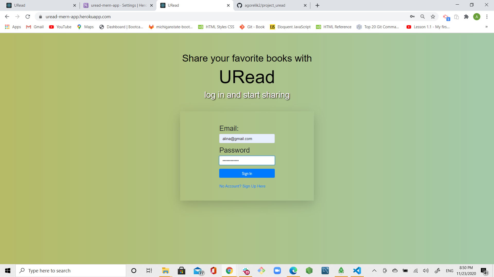
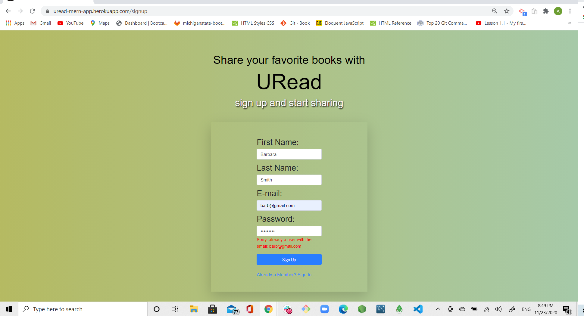
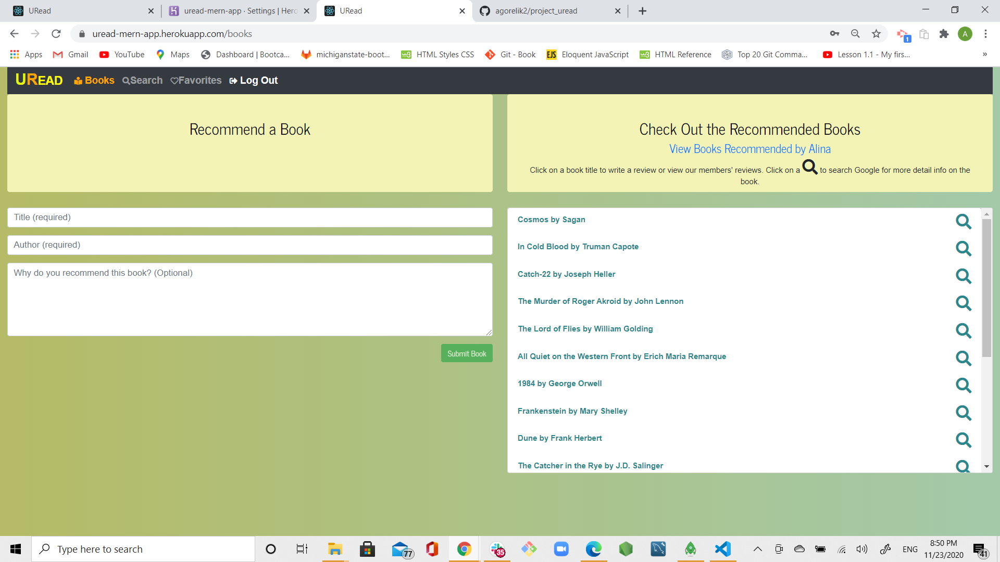
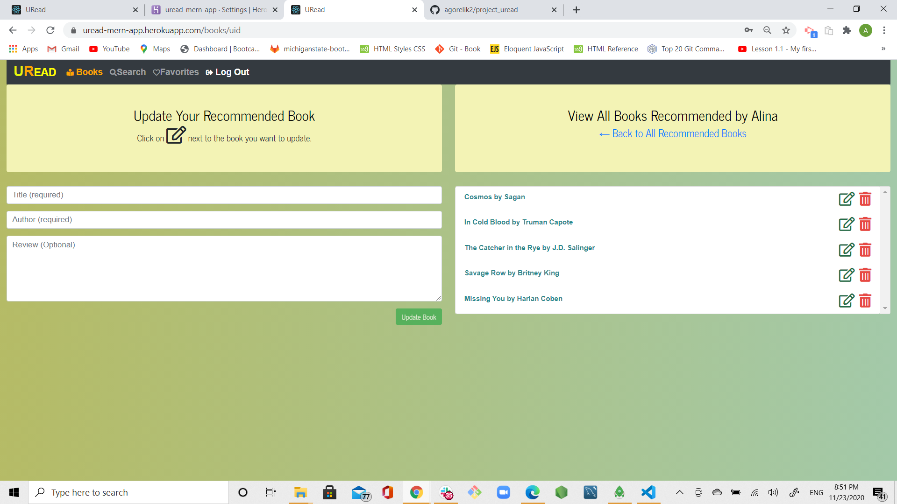
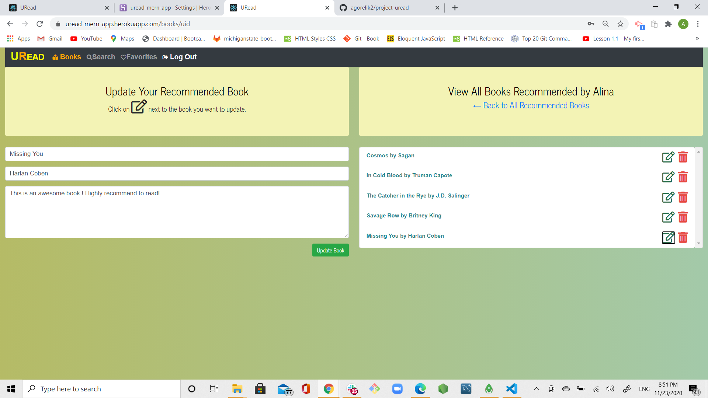
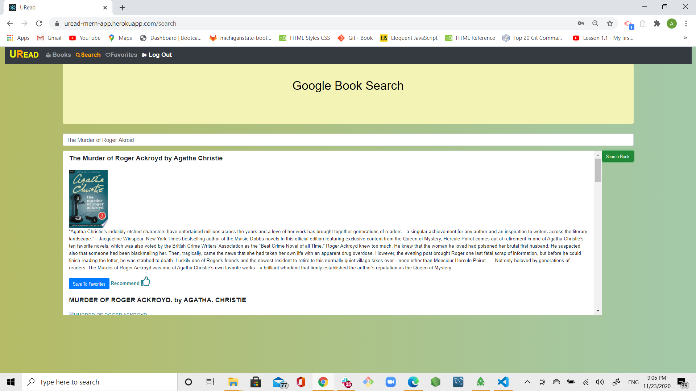
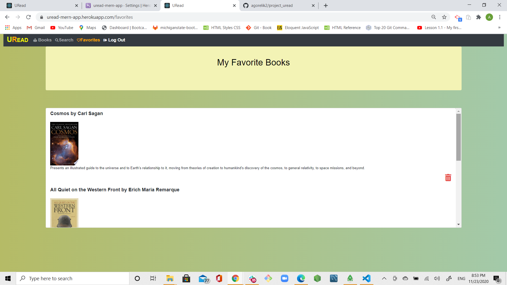
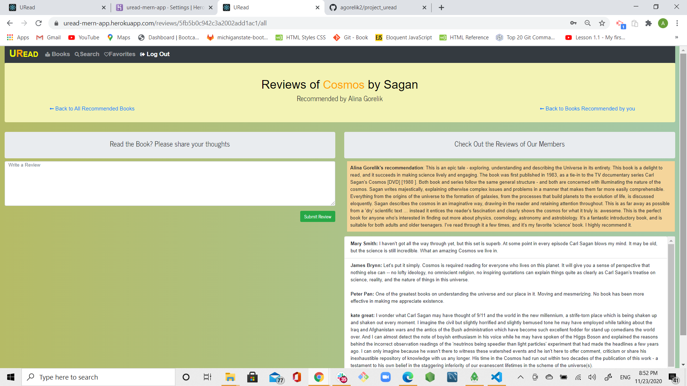

# project_uread

## Username:

agorelik2

## Title:

URead

### Google Book Search

[Link to the deployed application](https://uread-mern-app.herokuapp.com/)

## Table of Content

- [Description](#description)
- [User Story](#user-story)
- [Functionality](#functionality)
- [Database](#database)
- [Screen Shots](#screen-shots)
- [Development](#development)
- [Installation](#installation)
- [Dependencies](#dependencies)
- [Built With](#built-with)
- [Repo](#repo)
- [Demo](#demo)
- [Developer](#developer)

## Description

The URead app is a MERN application that utlizes React for front-end and the Google Books API. It allows users to find new books to read, search on and save their favorite books info, share their reading experiences, write reviews, and recommend books to other users. The saved book recommendations, reviews, and favorites are stored on MongoDB and retireved with Mongoose. The application also connects users to Google page for the book info and allows them to purchase books on Google.

## User Story

As a user, I want to be able to find new books to read based on recommendations of the people I know and trust. I would also like the ability to share my own reading experiences, review books, and create reading recommendations for my friends, family and co-workers. I am also looking for the ability to search for books on Google and save my favorite search results so I could return to the saved books later and have the link to purchase the books. The application should have a secure login and protect my sign-in information.

## Functionality

- This app requires users to sign up/create an account and log into the account subsequently. All user data is securely stored in the Mongo database with the password being hashed.

- After signing-in, user is redirected to books page that shows all the recommended books and allows the authenticated user to create a new book recommendation.

- From the books page, user is able to connect to:

  - userBooks page that shows all the books recommendations created by the user who signed in
  - search page that opens once user clicks on the search icon next to the book's title
  - reviews page that opens once user clicks on the book's title

- 'userBooks' page displays only the signed-in user's book recomendations. The purpose of this page is to allow users to update or delete their recommendations. To update the book recommendation, user has to click on the update icon next to the book's title, and the title, author and saved recommendation will be auto loaded into the form that will allow user to update any field, and re-save the recommendation. There is also a delete button next to the book recommendation that can be used to delete the recommendation.

- 'search' page can be accessed through the navigation bar or from the 'books' page. Search page allows user to search on a book via Google Books API by either directly typing the title into the search box or it can pre-fill the search box with a book title if accessed through the link on the books page. When presented with the search results, user can click on 'Save to Favorites' button to save a book, or 'Recommend a Book' link that will redirect him to the recommendations page (books) and prefill the recommendation form with book's title and author.

- 'reviews' page can be accessed by used clicking on the book's title on the recommendations (books) page. On the reviews page, user can enter his own review or read the reviews for the book created by other users.

- 'favorites' page can be accessed through the navigation bar, and displays all the books previously saved

## Database

The application uses MongoDB named `uread` that consists of the following collections/models connected via Mongoose:

1. USERS: id, first name, last name, email, password (hashed), userCreated (timestamp)
2. BOOKS: id, title, author, description, user (id of the user who created the recommendation), dateCreated timestamp
3. FAVORITES: id, AUTHORS [], user (id), googleid, image, title, description, link (to google)
4. REVIEWS: id, AUTHORS[], bookId, title, reviewBody, user (id), firstName and lastName

Associations:

- USER has many BOOKS, USER has many comments
- BOOK has many COMMENTS, BOOK belongs to USER
- COMMENT belongs to BOOK, COMMENT belongs to USER

## Screen Shots

Sign-in page

Sign up /Registration page for new users

Books page where you can recommend a book and view other people's recommendations, links to reviews

User's book page where you can update and delete your own book recommendations

User's book page: with the click of the update button, the form pre-fills with updated book title, author, and description

Search page where you can search on a book title, save to favorites and recommend that book

Favorites page where you can come back to view or buy the book through the link to Google

Reviews page where you can write a review or read the reviews given by other members

## Development

#### First Phase:

- Started by creating full stack structure for MERN app with REACT being a client. Used `npx create-react-app` to create REACT app in the `client` folder

- Created the MERN/MVC structure first and worked upon each element required. Started with installing all the required dependencies, setting up the environmental variables and securing the sensitive data like password and database name by using DOTENV dependency and .ENV file. Created code for server.js, added code to connect to a MongoDB database named `uread` using the mongoose npm package.

- Worked on database structure, started just with 2 collections: Users and Books. Worked on the initial phase of the application that included user's authentication utilizing passport middleware, and front-end and back-end programming changes to enable users create book recommendations, store it in the database, and retrieve all the events stored.

- Created utils/API.js code for axios connections serving USERS and BOOKS, and APP.js to include the new routes `/signin`, `/signup`, `/logout` for user authentication and `/books` for recommendations

- Build front-end code for SignIn, Signout and Books pages. Worked on REACT components utilized by SignIn, Signout and Books pages. Enabled routing in APP.js by using `BrowserRouter from "react-router-dom` in APP.js. On the front end, programmed login and getUsers functions for user authentication with passport and local strategy. Created REACT components and functions to find all book recomendations. On the back end, created code to handle routing for api/users and api/books.

### SECOND Phase

- Created functionality to allow `find all the books by userId`, including:

  - added new field to Book collection to store `user._id` when new book document/record is created
  - front-end code: new userBooks.js page/component
  - back end route/controller to find the books by user's id.
  - updated utils/API.js to create a new axios for api connection,
  - updated APP.js to include new route `books\uid`

- Created ability to search on a book utilizing Google Books API, and save favorite books in a new Favorite collection:
  - Created FAVORITES - new database collection/model
  - Updated utils/API.js to include new axios calls to serve database connections for favorites
  - Created back end code including routes and controllers for READ, CREATE and DELETE operations for favorites
  - On the front end, created two new pages/components: SEARCH.js and Favorites.js.
  - Updated APP.js to include new routes for `/search` and `/favorites`

### THIRD Phase

- Created ability for user to update and delete his own book recommendations

  - Created back end code including routes and controllers for PUT and DELETE operations for books
  - Updated utils/API.js to include new axios calls to serve database connections for PUT and DELETE
  - On the front end, created two new page userBooks.js and components serving it
  - Updated APP.js to include new route for `/userBooks`

- Created ability for user to add reviews

  - Created Reviews - new MongoDB collection/model
  - Created back end code including routes and controllers for CRUD operations with Reviews
  - Updated utils/API.js to include new axios calls to serve database connections for CRUD
  - On the front end, created new page comments.js and the components serving the page
  - Updated books.js and userBooks.js to include a link connection to comments.js page

### Front End

For this application, I have created React components, worked with helper/util functions, and utilized React lifecycle methods to query and display book recommendations, favorites, and reviews based on user searches.

### Back End:

I have built back-end utilizing three different sets of api routes/controllers:

BOOK routes/api/books.js and controllers/books.js handle the following operations:

1. read all the books recommendation stored routes/api/books --> get
2. read all the books recommendation by user id routes/api/books/uid --> get
3. read one book recommendation by book id routes/api/books/:id -->get
4. save a book recommendation routes/api/books --> post
5. delete a book recommendation routes/api/books/:id -->delete
6. update a book recommendation routes/api/books/:id --> put

USER routes/api/users.js and controllers/users.js handle the following operations:

1. find all the users stored routes/api/users/ --> get
2. login existing user routes/api/users/login --> post
3. logout user routes/api/users/logout --> get
4. signup for a new user routes/api/users/signup -->post
5. find user by id routes/api/users/:id --> get

FAVORITE routes/api/users.js and controllers/users.js handle the following operations:

1. find all the favorites by user id routes/api/favorites/uid --> get
2. save a favorite book routes/api/favorites --> post
3. delete a favorite book routes/api/favorites/:id -->delete

REVIEW
routes/api/users.js and controllers/users.js handle the following operations:

1. find all the reviews by book id routes/api/reviews/:id/all --> get
2. find one review by review id routes/api/reviews/:id --> get
3. save a review routes/api/reviews/:id --> post
4. delete a review routes/api/review/:id -->delete

I have also used Node, Express and MongoDB so that users can save books in MongoDB and return to buy the books later.

## Installation

To use this application locally:

- Install Node.js on your computer
- Clone the application
- Use `npm install` to install all the dependencies, see [Dependencies](#dependencies) for the complete list
- npm install axios
- use `npm start`to start the development local environment
- to deploy to production, run `npm run build` and this will trigger the build and then you can publish on Heroku

## Dependencies

    "dependencies": {
    "axios": "^0.21.0",
    "bcryptjs": "^2.4.3",
    "body-parser": "^1.19.0",
    "connect-mongo": "^3.2.0",
    "cookie-parser": "^1.4.5",
    "dotenv": "^8.2.0",
    "express": "^4.17.1",
    "express-session": "^1.17.1",
    "if-env": "^1.0.4",
    "mongoose": "^5.10.12",
    "passport": "^0.4.1",
    "passport-local": "^1.0.0",
    "router": "^1.3.5"
    "@testing-library/jest-dom": "^5.11.5",
    "@testing-library/react": "^11.1.1",
    "@testing-library/user-event": "^12.1.10",
    "bootstrap": "^4.5.3",
    "react": "^17.0.1",
    "react-bootstrap": "^1.4.0",
    "react-dom": "^17.0.1",
    "react-router-dom": "^5.2.0",
    "react-scripts": "4.0.0",
    "web-vitals": "^0.2.4"

}
Also, DEV dependencies:

    "concurrently": "^4.1.2",
    "nodemon": "^1.18.7"

## Built With

- [VScode](https://code.visualstudio.com/)
- [Gitbash](https://gitforwindows.org/)
- [node.js](https://nodejs.org/en/)
- [express.js](https://expressjs.com/)
- [react.js](https://reactjs.org/)
- [MongoDB](https://www.mongodb.com/)
- [mongoose](https://mongoosejs.com/)
- [heroku](https://dashboard.heroku.com/apps)

## Repo:

https://github.com/agorelik2/google-books-search

## Demo:

https://uread-mern-app.herokuapp.com/

## Developer

    Alina Gorelik
